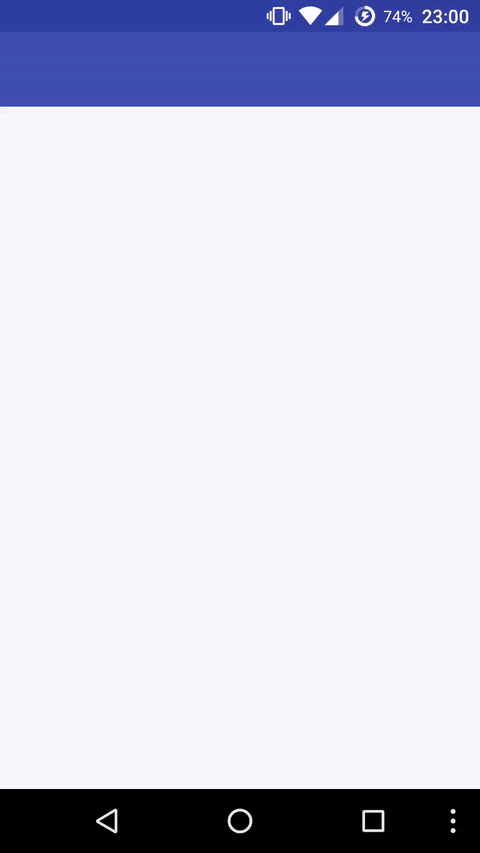

# DrawerLayout

DrawerLayout 是基于 `android.support.v4.widget.DrawerLayout`，而且全屏控制。

The DrawerLayout is forked from `android.support.v4.widget.DrawerLayout`, but full-screen.

# Usage

在最外面的 `build.gradle` 里加上 jitpack，别加到 buildscript 里了。

Add jitpack repository in top `build.gradle`, DO **NOT** ADD IT TO buildscript.

    allprojects {
        repositories {
            ...
            maven { url "https://jitpack.io" }
        }
    }

在项目 `build.gradle` 里添加 DrawerLayout 依赖。

Add DrawerLayout as dependency in project `build.gradle`.

    dependencies {
        ...
        compile 'com.github.seven332:drawerlayout:0.1.0'
    }

# License

    Copyright (C) 2015-2016 Hippo Seven

    Licensed under the Apache License, Version 2.0 (the "License");
    you may not use this file except in compliance with the License.
    You may obtain a copy of the License at

        http://www.apache.org/licenses/LICENSE-2.0

    Unless required by applicable law or agreed to in writing, software
    distributed under the License is distributed on an "AS IS" BASIS,
    WITHOUT WARRANTIES OR CONDITIONS OF ANY KIND, either express or implied.
    See the License for the specific language governing permissions and
    limitations under the License.
